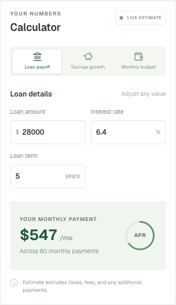

# Morrow Finance Calculator

A local-first finance toolkit for exploring loan payments, savings growth, and monthly cash flow. Adjust the numbers and see estimates update immediately, with contextual ideas to compare along the way.

## App Preview

<p align="center">
	
</p>
<p align="center"><em>Desktop dashboard</em></p>

<p align="center">
	
</p>
<p align="center"><em>Mobile calculator</em></p>

## Features

- **Loan payoff:** Estimate monthly payments and total interest, then compare the effect of an extra monthly payment.
- **Savings growth:** Project a starting balance plus recurring contributions with monthly compounding.
- **Monthly budget:** Compare take-home pay, expenses, and planned savings; explore an optional 20% savings target.
- **Live suggestions:** See a calculated next step for the current inputs, including an extra-payment comparison or a savings contribution scenario.
- **Responsive interface:** Use the calculator on desktop or mobile.
- **Private by default:** Calculations run in the browser. Values are not sent to a server or saved between visits.

## Run Locally

### Requirements

- Node.js 20.9 or newer
- npm

```sh
npm ci
npm run dev
```

Open [http://localhost:3000](http://localhost:3000).

## Validation

```sh
npm run lint
npm run typecheck
npm run build
npm audit
```

Or run the application checks together:

```sh
npm run check
```

GitHub Actions runs the checks and dependency audit on pushes and pull requests.

## Calculation Notes

- Loan estimates use a fixed annual interest rate divided into monthly periods. Fees, taxes, and lender-specific terms are excluded.
- Savings estimates assume a fixed annual return, monthly compounding, and contributions made at the end of each month.
- Budget estimates use the monthly values entered and do not account for irregular income or expenses.

These tools are for planning purposes only and are not financial, tax, or investment advice. Actual outcomes depend on product terms, fees, taxes, and changing rates.